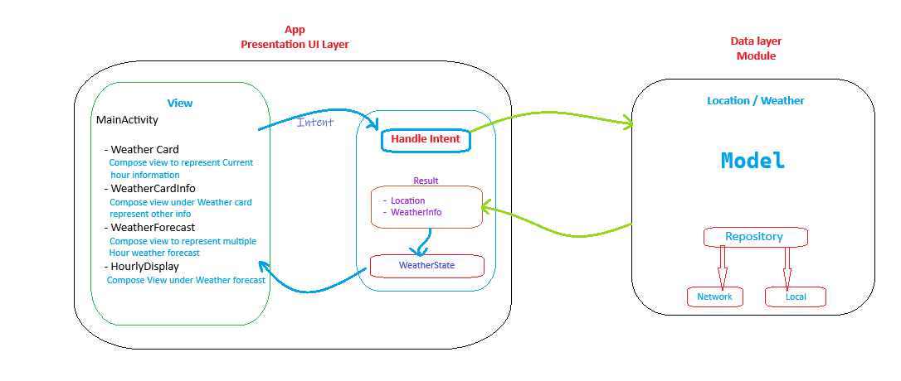

# Weather App (MVI + Clean Architecture)

This is a Weather application built using modern Android development practices, including Model-View-Intent (MVI) architecture and Clean Architecture principles.

## Overview

This application demonstrates a robust and scalable approach to building Android applications by separating concerns and promoting testability. It fetches weather data from a remote API and displays it to the user.

## Architecture

The application follows the **Clean Architecture** pattern, which divides the codebase into distinct layers

*   **Presentation Layer (App):**
    *   Responsible for displaying data to the user and handling user interactions.
    *   Uses the **Model-View-Intent (MVI)** architectural pattern.
    *   Composed of:
        *   **Screens:** `HourlyDisplay.kt`, `WeatherCard.kt`,`WeatherCardInfo.kt`, `WeatherForecast.kt` Displays the UI and emits user intents.
        *   **state:** `WeatherState.kt` Represents the UI state.
        *   **ViewModel:** `WeatherViewModel.kt` Processes intents, updates the model, and exposes the model to the view.

## MVI (Model-View-Intent)

The Presentation layer utilizes the MVI pattern to manage UI state and interactions:

*   **Model (State):** An immutable data class that represents the current state of the UI.
*   **View:** The UI component (e.g., an Activity and Screens) that displays the state and emits user intents.
*   **Intent:** Represents a user action or event (e.g., `loadWeatherInfo()`, `getCurrentLocation()`).
*   **ViewModel:**
    *   Receives intents from the View.
    *   Processes intents by interacting with Use Cases in the Domain layer.
    *   Updates the Model (State) based on the results of the Use Cases.
    *   Exposes the Model (State) to the View for rendering.

-----------------
## Technologies Used

*   **Kotlin:** The primary programming language.
*   **Jetpack Compose:** Modern declarative UI toolkit.
*   **Coroutines:** For asynchronous programming.
*   **Hilt:** For dependency injection.
*   **Retrofit:** For network communication.
*   **Clean Architecture:** For code organization and separation of concerns.
*   **MVI:** For managing UI state and interactions.
*   **Gradle:** For build automation.

## Project Structure
A very high-level view of the Architecture:

